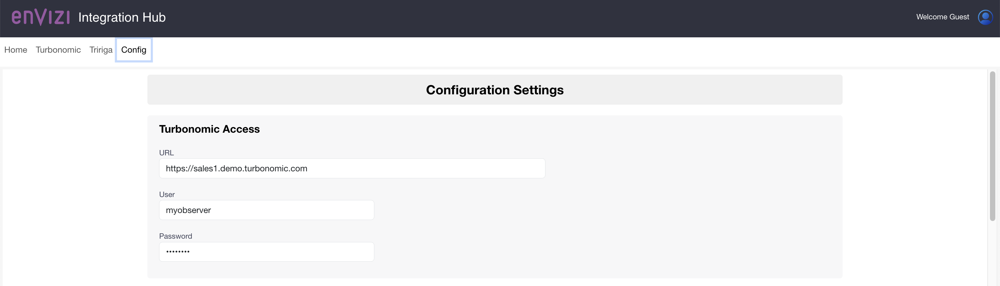
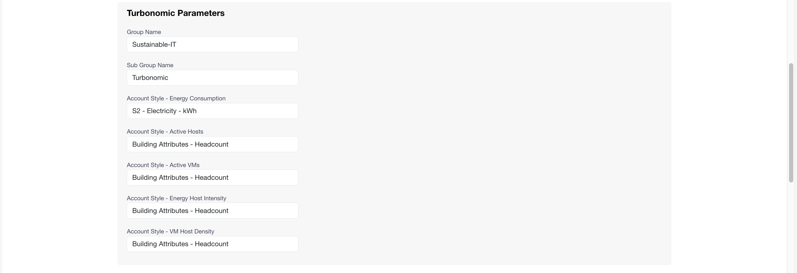
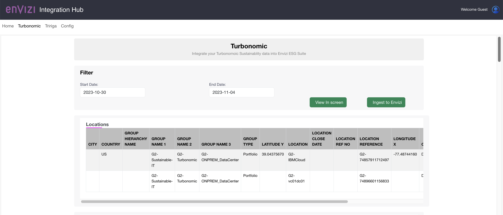
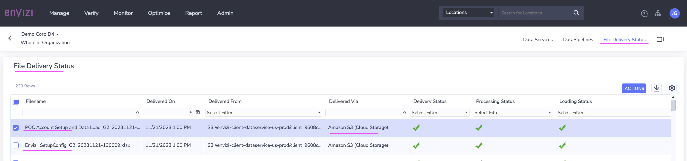

# Envizi Integration Hub - Integrating Turbonomic with Envizi 

Envizi Integration Hub facilitates the integration of data from various external systems into the IBM Envizi ESG Suite.

It connects to external systems, such as Turbonomic, retrieves emissions data, converts this data into the Universal Account Setup and Data Loading format (UDC), and then dispatches it to an S3 bucket configured within the IBM Envizi ESG Suite.


This tutorial gives you an overview about how to use Envizi Integration Hub to Integrate Turbonomic data into IBM Envizi ESG Suite.

1. Create Data Service and Data Pipeline in Envizi
2. Start the Envizi Integration Hub App
3. Update the Configuration settings
4. Ingest Turbonomic Data into Envizi
5. View the Turbonomic Data in Envizi

## Pre-Requisite

## Pre-Requisites

To run this tutorial you need to have the followings.

1. IBM Envizi ESG Suite access with Administrator privileges.
2. Docker runtime to run the docker container in your system.


You need to have docker runtime to run the docker container in your system.

## 1. Create Data Service and Data Pipeline in Envizi

Envizi Integration Hub leverages  Envizi Data Service and Envizi Data Pipeline to integrate external systems into in Envizi.

### 1.1 Create Data Service

You need to create Data Service in Envizi. You can refer the tutorial https://developer.ibm.com/tutorials/awb-sending-udc-excel-to-s3/ for the detailed steps.

1. Create Data service in envizi. 


2. Note down the following values for future reference:
Bucket
Folder
Username
Access Key
Secret Access Key

### 1.2 Create Data Pipeline

You need to create Data Pipeline in Envizi. You can refer the tutorial https://developer.ibm.com/tutorials/awb-sending-udc-excel-to-s3/ for the detailed steps.

1. Create Data Pipeline in envizi. 


2. Run the Envizi Integration Hub

## 2. Start the Envizi Integration Hub App 

### 2.1 Prepare Config file

#### 1. Download the Property file

Download the [envizi-config.json](./files/envizi-config.json)

#### 2. Update Envizi s3 bucket details

Update the below envizi s3 bucket details from the data we noted while creating Data service in envizi.

```
  "envizi": {
    "access": {
      "bucket_name": "envizi-client-dataservice-us-prod",
      "folder_name": "client_9608cd600af647",
      "access_key": "xxxx",
      "secret_key": "xxxxx"
    },
  }
```

#### 3. Update Envizi OrgName

Update `org_name` in `envizi` section.

The Org Name is your organization name in the org hierarchy.
```
  "envizi": {
    "parameters": {
      "org_name": "Demo Corp D4",
    }
  },
```


#### 4. Update Envizi Prefix (Optional)

Update `prefix` in `envizi` section.

This helps to create all the groups, locations and accounts created by this integration hub prefixed to avoid duplicates if any.
```
  "envizi": {
    "parameters": {
      "prefix": "G1"
    }
  },
```

#### 5. Update Turbonomic access

Update the below Turbonomic access details.

The user should have `Observer` role.

```
  "turbo": {
    "access": {
      "url": "https://abcd.turbonomic.com",
      "user": "",
      "password": ""
    },
  }
```
#### 6. Update Turbonomic parameters (Optional)

Update the below parameters as per need. 

Integration Hub pulls the Energy Consumption of each data center from Turbonomic and it is mapped to the below given `account_style` in Envizi. Each data center from Turbonomic is created as an account in Envizi under the given `sub_group` and `group`.

```
  "turbo": {
    "parameters": {
      "group": "Sustainable-IT",
      "sub_group": "Turbonomic",
      "account_style": "Electricity - kWh",
      "start_date": "2023-10-30",
      "end_date": "2023-11-04"
    }
  }
```
### 2.2 Start the Integration Hub App

1. Keep the envizi-config.json in the current folder

2. Run the below command to start the app.

for Mac
```
docker run -d -p 3001:3001  -v "./envizi-config.json" gandigit/e-int-hub-mac:latest
```

for linux
```
docker run -d -p 3001:3001  -v "./envizi-config.json" gandigit/e-int-hub-linux:latest
```

3. Open the url http://localhost:3001/ in the browser to see the home page.


## 3. Update the Configuration settings

The above updated `envizi-config.json` config file content would be displayed here for further update if any. 





## 4. Ingest Turbonomic Data into Envizi

1. Click on the `Turbonomic` menu and get into Turbonomic integration screen.


2. Enter the `Start Date` and `End Date` for the period to which we need to pull Turbonomic data.

3. Click on the  `Ingest to Envizi` button to kick start the Ingestion process.

4. You can see the `locations` and `accounts` data pulled by this Integration Hub in the screen. At the same time  the data might have been pushed to S3 for the integration with Envizi.




## 5. View the Turbonomic Data in Envizi

### 5.1 View File Delivery Status

View the `file delivery status` to see the `locations` and `accounts` related files are integrated into Envizi.



### 5.2 View Org hierarchy

View the `Org Hiearchy` to see the `groups`, `locations` and `accounts` are created in Envizi.


### 5.3 View Summary page

View the summary page to see the account details.


## Summary

Using the Envizi Integration Hub we were able to successfully integrate Turbonomic Data into the IBM Envizi ESG Suite


## Next steps

The next step is to Get a closer look at IBM Envizi and how it can help accelerate your ESG strategy.

Start your 14-day IBM Envizi ESG Suite trial
https://www.ibm.com/account/reg/us-en/signup?formid=urx-51938

Request your personalized IBM Envizi demo
https://www.ibm.com/account/reg/us-en/signup?formid=DEMO-envizi