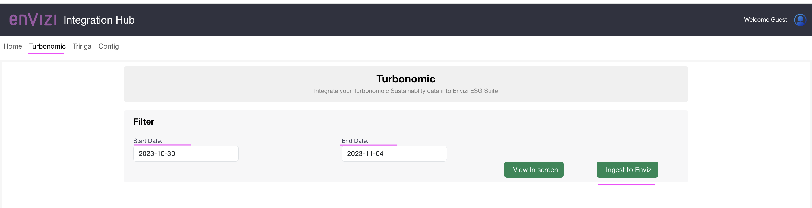
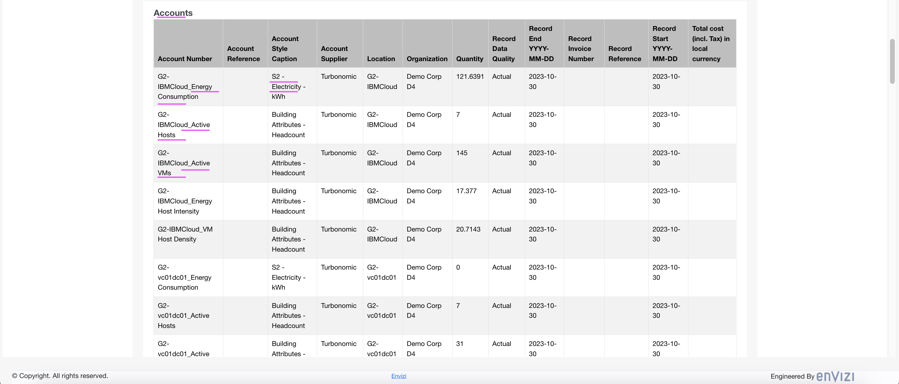

# Envizi Integration Hub - Integrating Turbonomic with Envizi 

Envizi Integration Hub facilitates the integration of data from various external systems into the IBM Envizi ESG Suite.

It connects to external systems, such as Turbonomic, retrieves emissions data, converts this data into the Universal Account Setup and Data Loading format (UDC), and then dispatches it to an S3 bucket configured within the IBM Envizi ESG Suite.


This tutorial gives you an overview about how to use Envizi Integration Hub to Integrate Turbonomic data into IBM Envizi ESG Suite.

Here is the summary of this tutorial

1. Create Data Service and Data Pipeline in Envizi to create AWS S3 buckets.
2. Prepare Configuration file with the S3 and Turbonomic access details.
3. Start the Integration Hub App with the Configuration file
4. Update the Configuration settings in the App if required
5. Ingest Turbonomic Data into Envizi via the App
6. View the Turbonomic Data in Envizi


Note: Tririga is mentioned in the diagram is for understanding purpose. It is not integrated yet in Hub.

## Pre-Requisites

To run this tutorial you need to have the followings.

1. IBM Envizi ESG Suite access with Administrator privileges.
2. Docker runtime to run the docker container in your system or Python installed to run via source code.

## 1. Create Data Service and Data Pipeline in Envizi

Envizi Integration Hub leverages  Envizi Data Service and Envizi Data Pipeline to integrate external systems into in Envizi.

### 1.1 Create Data Service

You need to create Data Service in Envizi. You can refer the tutorial https://developer.ibm.com/tutorials/awb-sending-udc-excel-to-s3/#step-1-create-a-data-service-for-aws-s3-bucket for the detailed steps.

1. Create Data service in envizi. 


2. Note down the following values for future reference:
Bucket
Folder
Username
Access Key
Secret Access Key

### 1.2 Create Data Pipeline

You need to create Data Pipeline in Envizi. You can refer the tutorial https://developer.ibm.com/tutorials/awb-sending-udc-excel-to-s3#step-2-create-a-data-pipeline for the detailed steps.

1. Create Data Pipeline in envizi. 


The file name patterns used here are       

```
^POC.*\.xlsx
^Envizi.*\.xlsx

```

## 2 Prepare Configuration file

#### 1. Download the Config file

Download the [envizi-config.json](./files/envizi-config.json)

#### 2. Update Envizi s3 bucket details

Update the below envizi s3 bucket details from the data we noted while creating Data service in envizi.

```
  "envizi": {
    "access": {
      "bucket_name": "envizi-client-dataservice-us-prod",
      "folder_name": "client_9608cd600af647",
      "access_key": "xxxx",
      "secret_key": "xxxxx"
    },
  }
```

#### 3. Update Envizi OrgName

Update `org_name` in `envizi` section.

The Org Name is your organization name in the org hierarchy.
```
  "envizi": {
    "parameters": {
      "org_name": "Demo Corp D4",
    }
  },
```


#### 4. Update Envizi Prefix (Optional)

Update `prefix` in `envizi` section.

This helps to create all the groups, locations and accounts created by this integration hub prefixed to avoid duplicates if any.
```
  "envizi": {
    "parameters": {
      "prefix": "G2"
    }
  },
```

#### 5. Update Turbonomic access

Update the below Turbonomic access details.

The user should have `Observer` role.

```
  "turbo": {
    "access": {
      "url": "https://abcd.turbonomic.com",
      "user": "",
      "password": ""
    },
  }
```
#### 6. Update Turbonomic parameters (Optional)

Here are the Turbonomic parameters. You may need to modify `account_style_xxxxx` properties as per your environment. Otherwise no updates are required in the parameters. You can see the below explanations about the parameters.

```
  "turbo": {
    "parameters": {
      "group": "Sustainable-IT",
      "sub_group": "Turbonomic",
      "account_style_energy_consumption": "S2 - Electricity - kWh",
      "account_style_active_hosts": "Building Attributes - Headcount",
      "account_style_active_vms": "Building Attributes - Headcount",
      "account_style_energy_host_intensity": "Building Attributes - Headcount",
      "account_style_vm_host_density": "Building Attributes - Headcount",
      "start_date": "2023-10-30",
      "end_date": "2023-11-04"
    }
  }
```

1. The `group` and `sub_group` are created as `Groups` in Organization Hierarchy.
2. Each datacenter from Turbonomic is created as a `Location` under the `sub_group`.
3. The below  `Accounts` and `Account Styles` should be created for each Datacenter from Turbonomic.
  ```
  Account                         Account Style
  -----------------------         ------------------------
  Energy Consumption      ---     Energy Consumption - kWh
  Active Hosts            ---     Active Hosts [Number]     
  Active VMs              ---     Active Virtual Machines [Number]
  Energy Host Intensity   ---     Energy Host Intensity - kWh/host
  VM Host Density         ---     Virtual Machine to Host Density - VM/Host
  ```
4. If you have these `Account Styles` in your environment you can update the `account_style_xxxxx` properties with the your values. Otherwise just leave it for default as they are available in UDC. 

## 3. Start the Integration Hub App

The Integration Hub App should be started with the configuration file.

To start the app, you can run the python source directly or via the Docker Container.

### 3.1 Start the App using Python source

1. Download the repo https://github.com/ibm-ecosystem-engineering/envizi-integration-hub-app .

2. Prepare the Configuration file `envizi-config.json`. (Sample file is available in `./config/envizi-config-sample.json`).

3. Keep the file is some folder. Lets us assume the file is located in `/tmp/envizi-config.json`

3. Go inside the root folder `envizi-integration-hub` of the downloaded repo.
```
cd envizi-integration-hub
```

4. Run the below command to create virtual environment (first time only).
```
python -m venv myvenv
source myvenv/bin/activate

python -m pip install -r requirements.txt
```

5. Run the below command to start the app. The config file location is given here and it should be an absolute Path.

```
export WRITE_INTERIM_FILES=FALSE
export LOGLEVEL=INFO
export ENVIZI_CONFIG_FILE="/tmp/envizi-config.json"

python app/main.py

```

6. Open the url http://localhost:3001/ in the browser to see the home page.


### 3.2 Start the App using Docker

Need to start the Integration Hub App with the prepared configuration file.

#### 3.2.1 Start the App

1. Keep the property file `envizi-config.json` in some folder. Lets us assume the file is located in `/tmp/envizi-config.json`

2. Run the below command to start the app.

The abolve file name is mentioned in the `-v` parameter here and suffixed with `:/app/envizi-config.json`

for Mac
```
docker run -d -p 3001:3001 --name my-e-int-hub -v "/tmp/envizi-config.json:/app/envizi-config.json" gandigit/e-int-hub-mac:latest

```

for linux
```
docker run -d -p 3001:3001 --name my-e-int-hub -v "/tmp/envizi-config.json:/app/envizi-config.json" docker.io/gandigit/e-int-hub-linux:latest
```

3. Open the url http://localhost:3001/ in the browser to see the home page.


#### 3.2.2 Stop the App (for info only)

Run the below commands one by one to stop the app.

```
docker stop my-e-int-hub
docker rm my-e-int-hub
```

#### 3.2.3 View the App logs (for info only)

Run the below command to view the logs of the app.

```
docker logs my-e-int-hub
```

## 4. Update Configuration settings in the App

The above prepared `envizi-config.json` config file content would be displayed here in app. The properties can be further updated here if required. 


## 5. Ingest Turbonomic Data into Envizi via the App

Lets ingest data from Turbonomic into Envizi.

1. Click on the `Turbonomic` menu and get into Turbonomic integration screen.



2. Enter the `Start Date` and `End Date` for the period to which we need to pull Turbonomic data.

3. Click on the  `Ingest to Envizi` button to kick start the Ingestion process.

4. You can see the `locations` and `accounts` data pulled by this Integration Hub in the screen. At the same time  the data might have been pushed to S3 for the integration with Envizi.





## 6. View the Turbonomic Data in Envizi

Lets view the Turbonomic Data in Envizi now.

### 6.1 View File Delivery Status

View the `file delivery status` to see the `locations` and `accounts` related files are integrated into Envizi.


### 6.2 View Org Hierarchy

View the `Org Hierarchy` to see the `groups`, `locations` and `accounts` are created in Envizi.

Here `Energy Consumption` related account is available.


Here the other accounts `Active Hosts`, `Active VMs` and etc are available.


### 6.3 View Summary page

View the summary page to see the account details.


## Summary

Using the Envizi Integration Hub we were able to successfully integrate Turbonomic Data into the IBM Envizi ESG Suite


## Next steps

The next step is to Get a closer look at IBM Envizi and how it can help accelerate your ESG strategy.

Start your 14-day IBM Envizi ESG Suite trial
https://www.ibm.com/account/reg/us-en/signup?formid=urx-51938

Request your personalized IBM Envizi demo
https://www.ibm.com/account/reg/us-en/signup?formid=DEMO-envizi